# SkillCanvas

> 말로 만드는 AI 업무 비서 빌더 — 내가 커스텀한 Claude 스킬을 부품처럼 쌓아 워크플로우로 조립하고, 갤러리로 공유.

## 📣 Introduction

<div align="center">

**⏯ SkillCanvas ⏹**

</div>

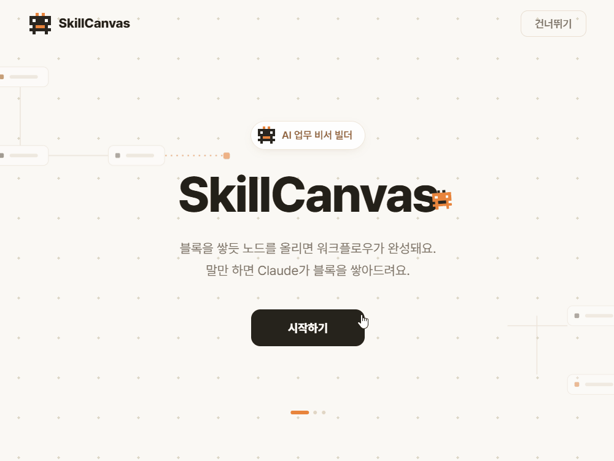

💻 AI 자동화를 조립하는 캔버스

- 자연어 한 줄로 자동화를 시작 — AI가 SKILL(재사용 부품)로 만들지 AUTO-FLOW(워크플로우)로 만들지 자동 분류
- 노드 기반 캔버스에서 SKILL과 도구를 연결해 워크플로우 구성
- 중복체크 → 검증 → 승인 게이트, 3단계 신뢰성 하네스로 실행 전 사람이 최종 확인
- SHARE 갤러리로 SKILL·워크플로우 공유, MY WORLD에서 내 자동화 관리

### Medium

[SkillCanvas 팀 블로그](https://medium.com/@vehshsjebg_14297/siliconvalley-summer-bootcamp-team-d-skillcanvas-9df0cbb36f9f)

## 🎥 Demo

### CREATE — 자연어로 시작하기

원하는 자동화를 문장으로 입력하면, AI가 이걸 SKILL(재사용 부품)로 만들지 AUTO-FLOW(워크플로우)로 만들지 자동으로 판단합니다. 복잡한 설정 화면 없이, 대화하듯 자동화를 시작할 수 있습니다.

- 점수 기반으로 스킬 or 오토플로우 추천
    - AI가 명시해둔 판단 기준에 따라 스킬과 오토플로우 각각 독립적으로 점수 부여 (0~100)
    - 최종 판단은 백엔드가 규칙으로 (이긴 쪽이 60미만이거나 둘의 차이가 20미만이면 중립처리)

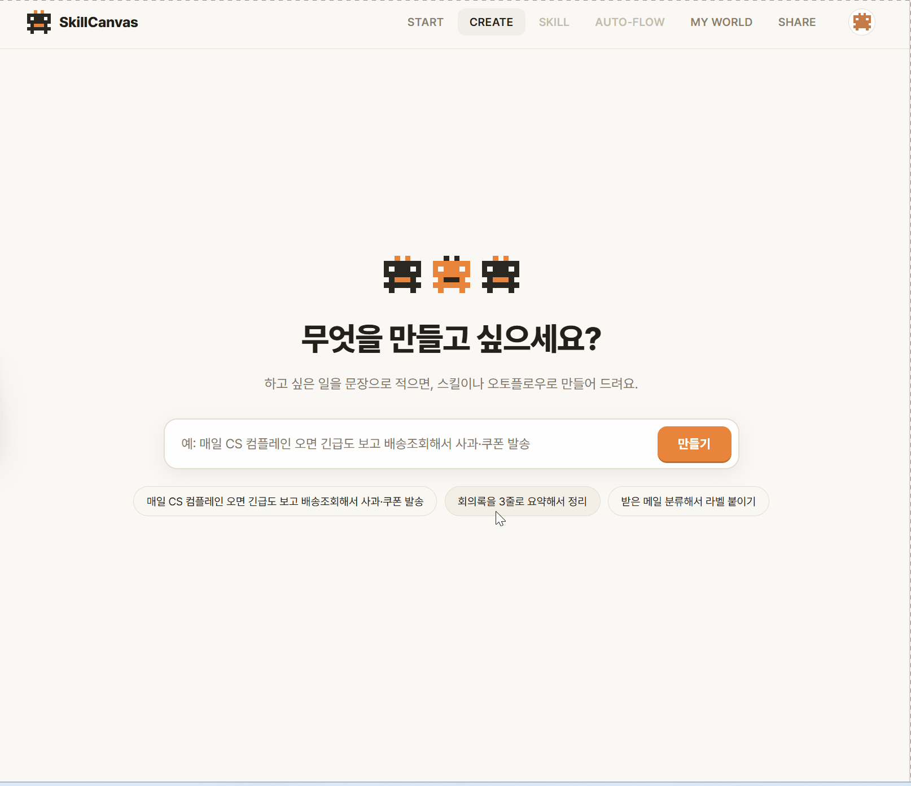

### SKILL — 부품 창고

"저장 위치를 Notion으로 바꿔줘"라고 요청하면, AI가 즉시 블록의 연결 도구를 교체합니다. 코드 수정 없이 대화만으로 자동화의 세부 동작을 조정할 수 있습니다.

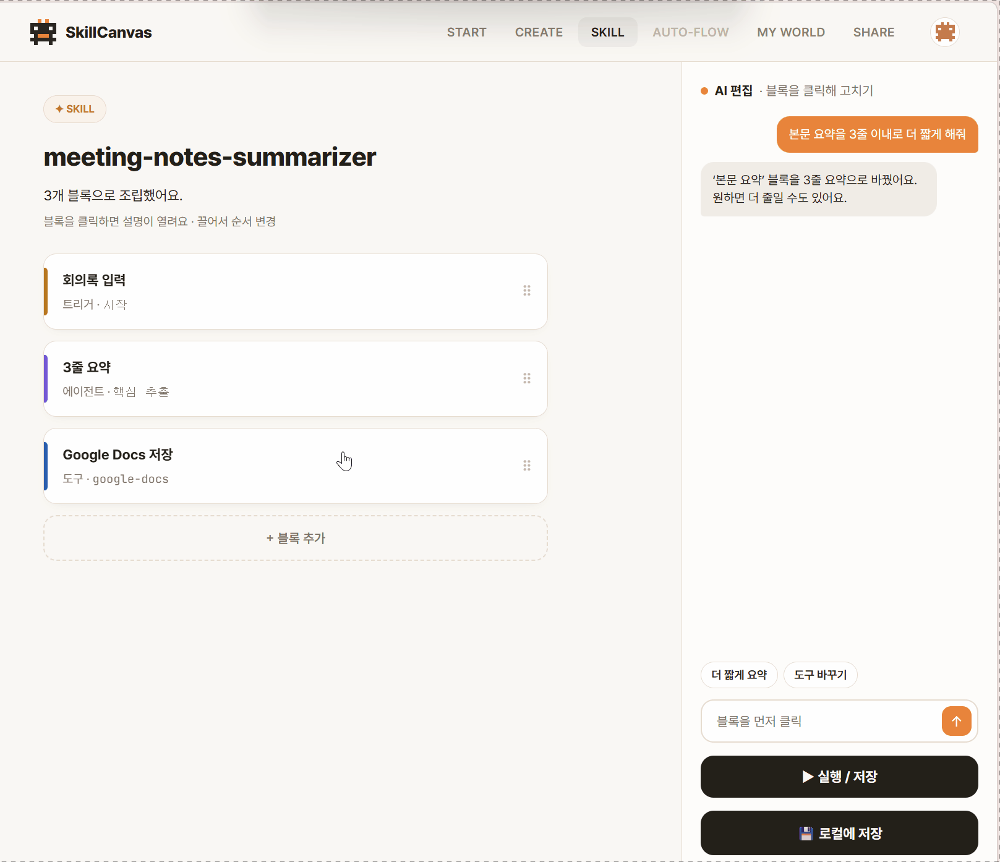

### AUTO-FLOW — 노드 기반 워크플로우 빌더

AUTO-FLOW는 노드와 엣지로 이루어진 시각적 캔버스입니다.

자연어 요청을 입력하면 AI가 트리거부터 출력까지 노드를 자동으로 배치하고 연결하며, 필요한 외부 도구도 함께 추천합니다.

각 노드는 클릭해 세부 내용을 확인·수정할 수 있고, 채팅으로 "재시도 로직 추가해줘" 같은 요청을 하면 AI가 새 노드를 제안합니다.

도구가 본인 인증 키를 요구하는 경우에는 카탈로그를 기준으로 정확히 판단해, 필요한 곳에서만 키 연결 안내를 표시합니다.

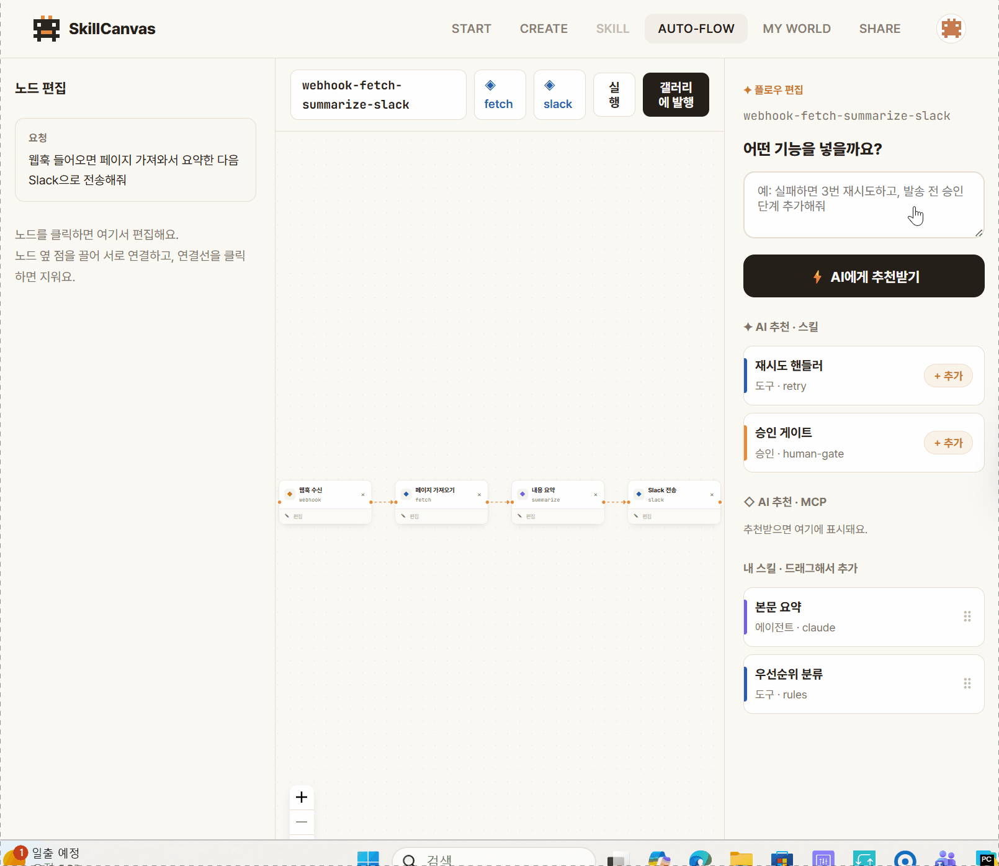

### 승인 게이트

AI가 작업을 실행하는 중, 승인이 필요한 지점에서 자동으로 멈춥니다. "승인하고 계속" 버튼을 눌러야만 다음 단계로 진행되며, 그 전까지는 어떤 실행도 이루어지지 않습니다.

"AI가 알아서 다 하는" 방식이 아니라, "AI가 준비하고 사람이 최종 확인하는" human-in-the-loop 구조입니다.

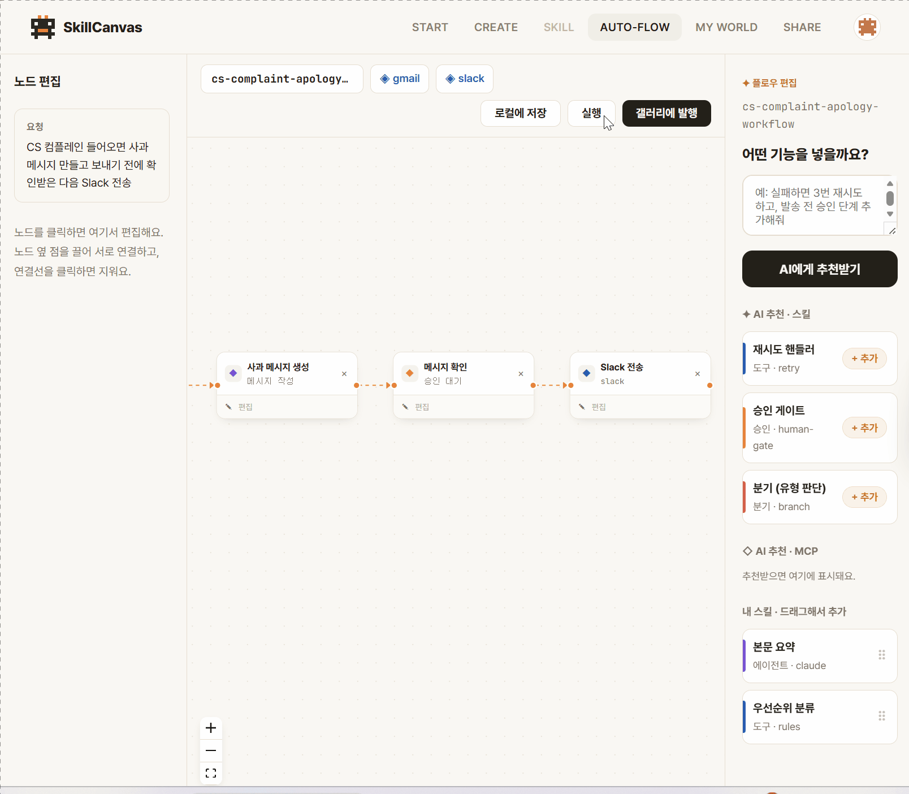

### SHARE & MY WORLD

완성한 자동화는 갤러리에 공유하고, 마음에 드는 것은 가져와 바로 씁니다. MY WORLD의 "내 MCP 키 현황"에서는 어떤 도구에 인증 키를 등록했는지, 어떤 도구는 키가 필요 없는지 칩으로 구분해 보여줍니다. 키는 클라우드가 아닌 사용자 PC에만 저장됩니다.

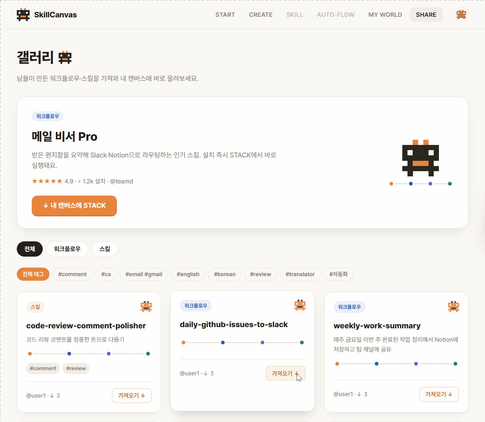

## 💻 System Architecture

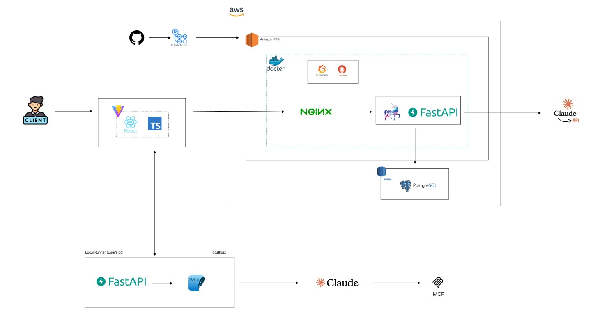

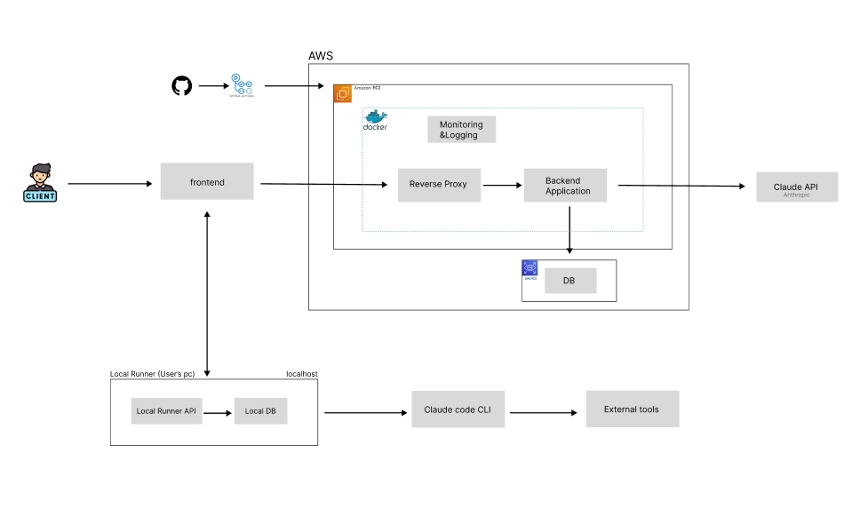

## 💾 ERD

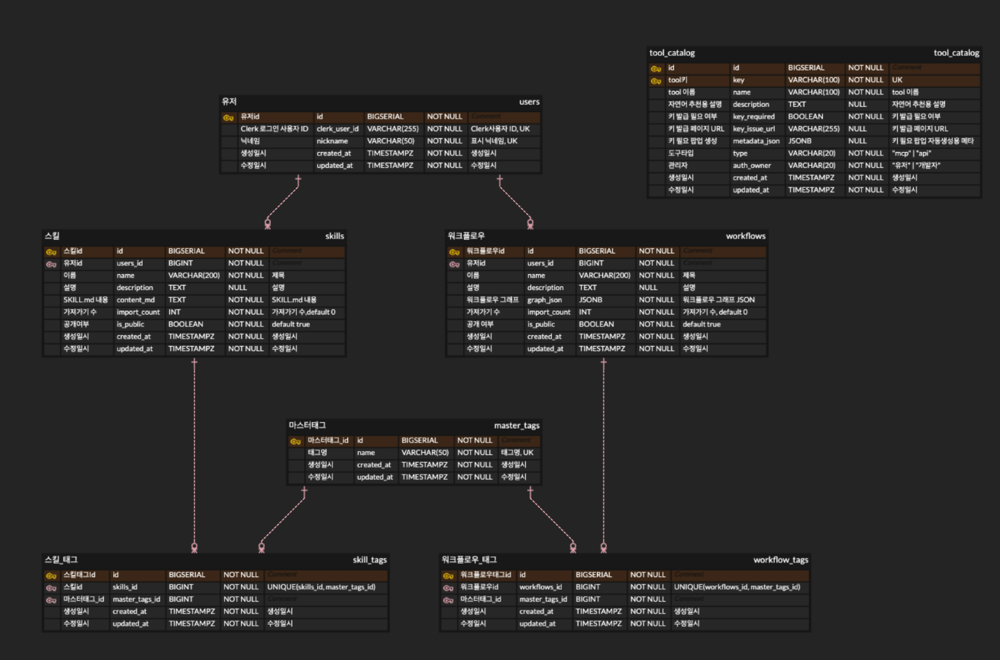

## 🛠️ Tech Stack

| 분야 | 사용 기술 |
| --- | --- |
| Frontend |       |
| Backend |        |
| Local Runner |     |
| Database |    |
| DevOps |     |
| Monitoring |     |
| ETC |      |

## 🔒 Reliability Harness

SkillCanvas의 데모 핵심 기능입니다. AI가 작업을 실행하기 전, 다음 3단계를 반드시 거칩니다.

1. **중복체크** — 동일 작업이 이미 처리되었는지 확인
2. **검증** — 실행 파라미터 유효성 검사
3. **🚨 승인 게이트** — 사람이 직접 승인해야만 실제 실행으로 이어지는 human-in-the-loop 구조

"AI가 알아서 다 한다"가 아니라 "AI가 준비하고 사람이 승인한다"는 원칙으로 설계했습니다.

## API

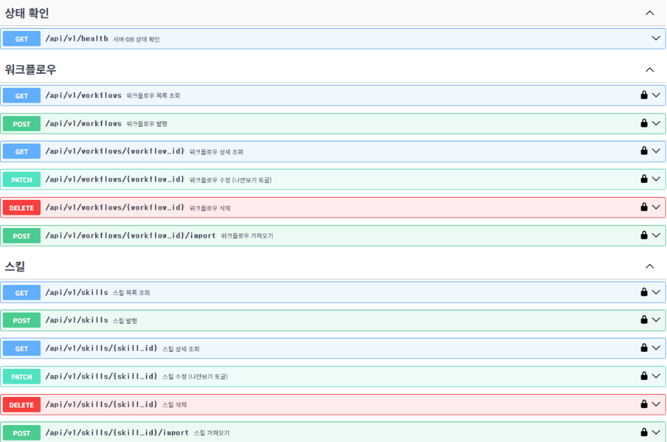

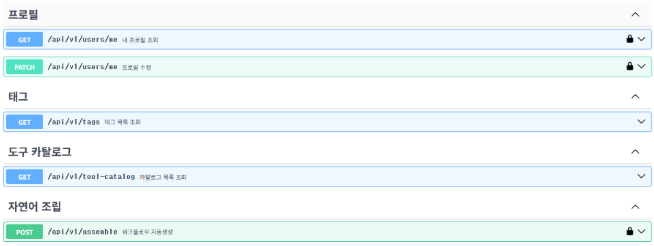

## Monitoring

<h3 align="left">Prometheus & Grafana</h3>
<table>
    <tr>
        <th>Postgres</th>
    </tr>
    <tr>
        <td>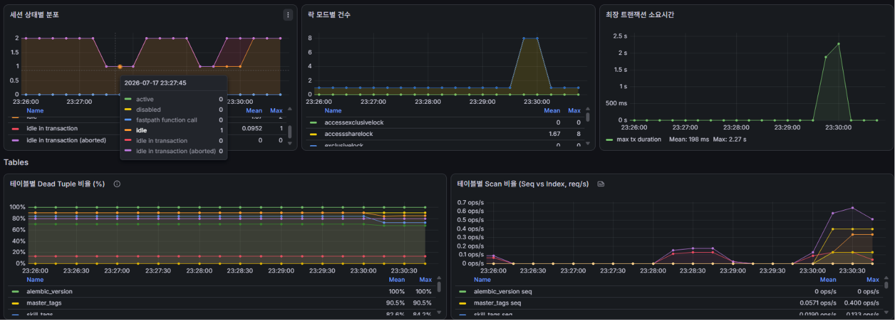</td>
    </tr>
    <tr>
        <th>노드 컨테이너</th>
    </tr>
    <tr>
        <td>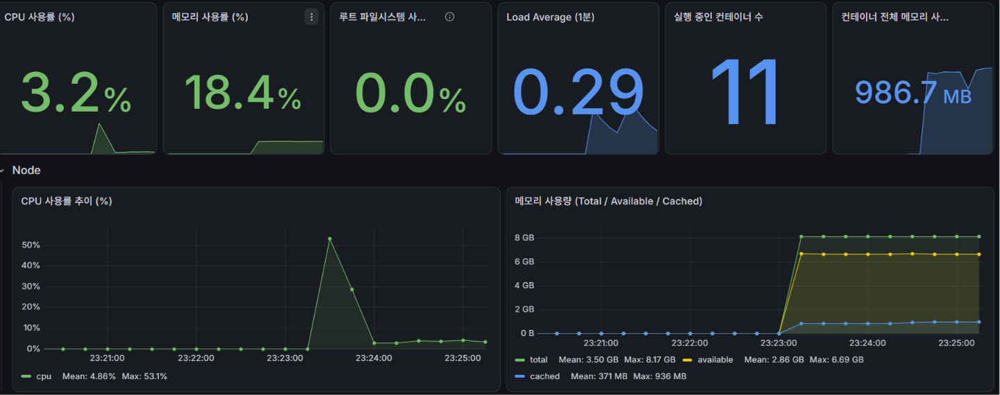</td>
    </tr>
    <tr>
        <th>5xx by Handler</th>
    </tr>
    <tr>
        <td>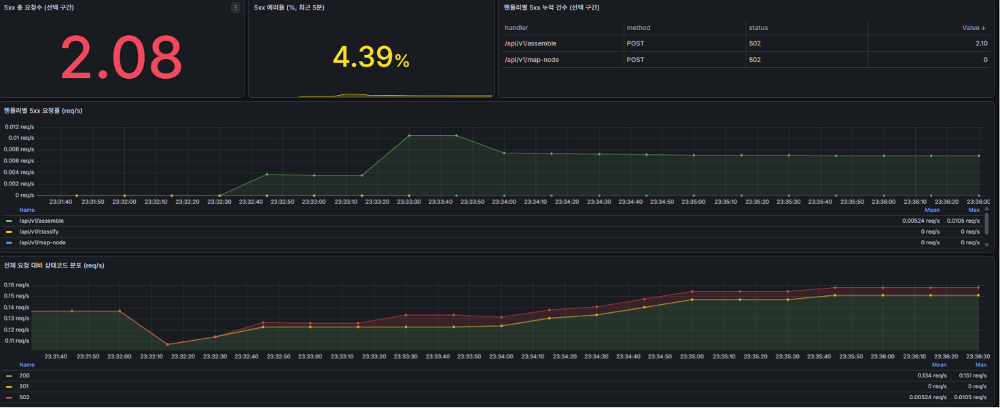</td>
    </tr>
    <tr>
        <th>AI Call Metrics</th>
    </tr>
    <tr>
        <td>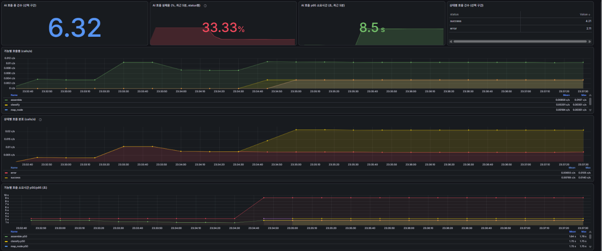</td>
    </tr>
</table>

## 🚀 How to Start

### 1. Clone & 환경 변수

```bash
git clone https://github.com/2026-summer-techeer-bootcamp-teamD/skillcanvas.git
cd skillcanvas

cp backend/.env.example  backend/.env
cp frontend/.env.example frontend/.env
```

### 2. 백엔드 + DB 실행

```bash
docker compose up
```

### 3. 프론트엔드 실행

```bash
cd frontend && npm install && npm run dev
```

### 4. 로컬 실행기 실행

```bash
cd local-runner
python -m venv .venv && source .venv/bin/activate
pip install -r requirements.txt
uvicorn app.main:app --port 4737 --reload
```

- **sandbox** — 기본은 `local-runner/sandbox/.claude`(샘플 스킬)만 다뤄서 내 실제 `~/.claude`는 건드리지 않습니다. 진짜 홈으로 돌리려면 `RUNNER_BASE_DIR=~`.
- **agent 노드** — 실제 판단·생성은 로컬 `claude -p` CLI로 실행돼서, 각자 PC에 [Claude Code CLI](https://docs.claude.com/en/docs/claude-code) 설치·로그인이 필요합니다.

## 👥 Team Members

| **이현영** | **고예승** | **정혜원** | **조예찬** |
| :---: | :---: | :---: | :---: |
| Leader<br>Fullstack<br>DevOps | Backend<br>DevOps | Frontend<br>Design | Backend |
| [@hyl1115](https://github.com/hyl1115) | [@reval04](https://github.com/reval04) | [@jungjungjungdd-ai](https://github.com/jungjungjungdd-ai) | [@yecnnz](https://github.com/yecnnz) |
