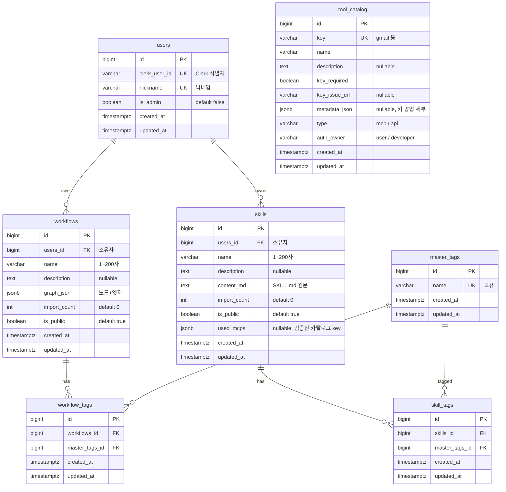

# 🗄️ SkillCanvas — ERD (서버 DB / PostgreSQL)

> 실제 SQLAlchemy 모델(`backend/app/models/`) 기준. **갤러리 서버 DB만** 대상 (로컬 SQLite는 ERD 아님).
> 엔티티 7개: `users` · `workflows` · `skills` · `master_tags` · `workflow_tags` · `skill_tags` · `tool_catalog`
> 공통 규칙(확정): PK=`id`(BIGINT) · FK=`참조테이블명+_id`(예 `users_id`) · 전 테이블 `created_at`/`updated_at`(TIMESTAMPTZ) · 연결 테이블은 **surrogate PK(id) + UNIQUE(쌍)**.

---

## 1. ERD 다이어그램 (Mermaid)



> `tool_catalog`는 **독립 테이블** (다른 것과 관계 없음 — 지원 도구 레지스트리).
> 연결 테이블(`workflow_tags`·`skill_tags`)은 복합 PK가 아니라 **surrogate PK(id) + UNIQUE(두 FK 쌍)** 방식.

---

## 2. 엔티티 상세

### users (앱 유저 · Clerk 연동)
| 컬럼 | 타입 | 제약 | 설명 |
| --- | --- | --- | --- |
| `id` | BIGINT | PK, auto | 유저 id |
| `clerk_user_id` | VARCHAR(255) | **UNIQUE**, NOT NULL, INDEX | Clerk 식별자 |
| `nickname` | VARCHAR(50) | **UNIQUE**, NOT NULL | 닉네임 |
| `is_admin` | BOOLEAN | NOT NULL, DEFAULT false | 관리자 여부 (ADMIN_EMAILS 첫 로그인 시 true) |
| `created_at` | TIMESTAMPTZ | NOT NULL, DEFAULT now() | 가입일 |
| `updated_at` | TIMESTAMPTZ | NOT NULL, DEFAULT now(), onupdate | 수정일 |

### workflows
| 컬럼 | 타입 | 제약 | 설명 |
| --- | --- | --- | --- |
| `id` | BIGINT | PK, auto | |
| `users_id` | BIGINT | **FK → users.id**, NOT NULL, INDEX | 소유자 |
| `name` | VARCHAR(200) | NOT NULL | 워크플로우 이름 |
| `description` | TEXT | NULL | 설명 |
| `graph_json` | JSONB | NOT NULL | 노드+엣지 그래프 |
| `import_count` | INTEGER | NOT NULL, DEFAULT 0 | 가져가기 수 |
| `is_public` | BOOLEAN | NOT NULL, DEFAULT true | 공개 여부 |
| `created_at` | TIMESTAMPTZ | NOT NULL, DEFAULT now() | 발행일 |
| `updated_at` | TIMESTAMPTZ | NOT NULL, DEFAULT now(), onupdate | 수정일 |

### skills
| 컬럼 | 타입 | 제약 | 설명 |
| --- | --- | --- | --- |
| `id` | BIGINT | PK, auto | |
| `users_id` | BIGINT | **FK → users.id**, NOT NULL, INDEX | 소유자 |
| `name` | VARCHAR(200) | NOT NULL | 스킬명 |
| `description` | TEXT | NULL | 설명 |
| `content_md` | TEXT | NOT NULL | SKILL.md 원문 (frontmatter 포함) |
| `import_count` | INTEGER | NOT NULL, DEFAULT 0 | 가져가기 수 |
| `is_public` | BOOLEAN | NOT NULL, DEFAULT true | 공개 여부 |
| `used_mcps` | JSONB | NULL | 발행 시 검증된 카탈로그 key 목록 (NULL=레거시→content_md에서 폴백 추출) |
| `created_at` | TIMESTAMPTZ | NOT NULL, DEFAULT now() | |
| `updated_at` | TIMESTAMPTZ | NOT NULL, DEFAULT now(), onupdate | |

### master_tags (태그 원본 풀)
| 컬럼 | 타입 | 제약 | 설명 |
| --- | --- | --- | --- |
| `id` | BIGINT | PK, auto | |
| `name` | VARCHAR(50) | **UNIQUE**, NOT NULL | 태그명 (발행 시 get-or-create) |
| `created_at` | TIMESTAMPTZ | NOT NULL, DEFAULT now() | |
| `updated_at` | TIMESTAMPTZ | NOT NULL, DEFAULT now(), onupdate | |

### workflow_tags (M:N 연결 테이블)
| 컬럼 | 타입 | 제약 | 설명 |
| --- | --- | --- | --- |
| `id` | BIGINT | PK, auto | surrogate 키 |
| `workflows_id` | BIGINT | **FK → workflows.id**, NOT NULL, INDEX | |
| `master_tags_id` | BIGINT | **FK → master_tags.id**, NOT NULL, INDEX | |

> UNIQUE(`workflows_id`, `master_tags_id`) = `uq_workflow_tag` (같은 쌍 중복 방지 · 비식별관계) + `created_at`/`updated_at`

### skill_tags (M:N 연결 테이블)
| 컬럼 | 타입 | 제약 | 설명 |
| --- | --- | --- | --- |
| `id` | BIGINT | PK, auto | surrogate 키 |
| `skills_id` | BIGINT | **FK → skills.id**, NOT NULL, INDEX | |
| `master_tags_id` | BIGINT | **FK → master_tags.id**, NOT NULL, INDEX | |

> UNIQUE(`skills_id`, `master_tags_id`) = `uq_skill_tag` + `created_at`/`updated_at`

### tool_catalog (지원 도구 레지스트리 · 독립)
| 컬럼 | 타입 | 제약 | 설명 |
| --- | --- | --- | --- |
| `id` | BIGINT | PK, auto | |
| `key` | VARCHAR(100) | **UNIQUE**, NOT NULL, INDEX | 식별키 (gmail·notion 등) |
| `name` | VARCHAR(100) | NOT NULL | 표시명 |
| `description` | TEXT | NULL | 설명 |
| `key_required` | BOOLEAN | NOT NULL | 키 입력 필요 여부 |
| `key_issue_url` | VARCHAR(255) | NULL | 키 발급 링크 |
| `metadata_json` | JSONB | NULL | 키 팝업 세부(fields·guide 등) |
| `type` | VARCHAR(20) | NOT NULL | mcp / api |
| `auth_owner` | VARCHAR(20) | NOT NULL | user(본인 키) / developer(공용 키) |
| `created_at` | TIMESTAMPTZ | NOT NULL, DEFAULT now() | |
| `updated_at` | TIMESTAMPTZ | NOT NULL, DEFAULT now(), onupdate | |

---

## 3. 관계 요약

| 관계 | 카디널리티 | 구현 |
| --- | --- | --- |
| users — workflows | 1 : N | `workflows.users_id` FK |
| users — skills | 1 : N | `skills.users_id` FK |
| workflows — master_tags | N : M | `workflow_tags` 연결 테이블 (surrogate PK + UNIQUE) |
| skills — master_tags | N : M | `skill_tags` 연결 테이블 (surrogate PK + UNIQUE) |
| tool_catalog | 독립 | 관계 없음 |

---

## 4. DBML (dbdiagram.io 붙여넣기용)

```dbml
Table users {
  id bigint [pk, increment]
  clerk_user_id varchar [unique, not null]
  nickname varchar [unique, not null]
  is_admin boolean [not null, default: false]
  created_at timestamptz [not null, default: `now()`]
  updated_at timestamptz [not null, default: `now()`]
}
Table workflows {
  id bigint [pk, increment]
  users_id bigint [ref: > users.id, not null]
  name varchar [not null]
  description text
  graph_json jsonb [not null]
  import_count int [not null, default: 0]
  is_public boolean [not null, default: true]
  created_at timestamptz [not null, default: `now()`]
  updated_at timestamptz [not null, default: `now()`]
}
Table skills {
  id bigint [pk, increment]
  users_id bigint [ref: > users.id, not null]
  name varchar [not null]
  description text
  content_md text [not null]
  import_count int [not null, default: 0]
  is_public boolean [not null, default: true]
  used_mcps jsonb
  created_at timestamptz [not null, default: `now()`]
  updated_at timestamptz [not null, default: `now()`]
}
Table master_tags {
  id bigint [pk, increment]
  name varchar [unique, not null]
  created_at timestamptz [not null, default: `now()`]
  updated_at timestamptz [not null, default: `now()`]
}
Table workflow_tags {
  id bigint [pk, increment]
  workflows_id bigint [ref: > workflows.id, not null]
  master_tags_id bigint [ref: > master_tags.id, not null]
  created_at timestamptz [not null, default: `now()`]
  updated_at timestamptz [not null, default: `now()`]
  indexes { (workflows_id, master_tags_id) [unique, name: 'uq_workflow_tag'] }
}
Table skill_tags {
  id bigint [pk, increment]
  skills_id bigint [ref: > skills.id, not null]
  master_tags_id bigint [ref: > master_tags.id, not null]
  created_at timestamptz [not null, default: `now()`]
  updated_at timestamptz [not null, default: `now()`]
  indexes { (skills_id, master_tags_id) [unique, name: 'uq_skill_tag'] }
}
Table tool_catalog {
  id bigint [pk, increment]
  key varchar [unique, not null]
  name varchar [not null]
  description text
  key_required boolean [not null]
  key_issue_url varchar
  metadata_json jsonb
  type varchar [not null]
  auth_owner varchar [not null]
  created_at timestamptz [not null, default: `now()`]
  updated_at timestamptz [not null, default: `now()`]
}
```

---

## 5. 🔎 팀원 피드백 체크리스트 (흔히 틀리는 곳)

> 팀원이 그려온 ERD를 이걸로 검수하면 됨. (우리 확정 컨벤션 기준)

| # | 자주 하는 실수 | 정답 |
|---|---------------|------|
| 1 | **M:N을 연결 테이블 없이** workflows에 tags를 컬럼/배열로 | `workflow_tags`·`skill_tags` **연결 테이블** 필요 |
| 2 | 연결 테이블 PK 방식 | 우리 컨벤션 = **surrogate PK(id) + UNIQUE(두 FK 쌍)** (비식별관계). 복합 PK 아님 |
| 3 | **가져가기 수를 별도 테이블**(좋아요처럼)로 | `import_count` **컬럼**이 맞음 (테이블 X) |
| 4 | **FK 방향 반대** (users에 workflow_id 넣음) | FK는 **workflows.users_id → users.id** (N쪽이 FK 보유) |
| 5 | FK 이름 규칙 | `참조테이블명+_id` (예 `users_id`·`workflows_id`·`master_tags_id`) |
| 6 | `clerk_user_id`·`nickname` **UNIQUE 빠뜨림** | 둘 다 UNIQUE |
| 7 | `master_tags.name` **UNIQUE 빠뜨림** | 같은 태그 중복 방지 → UNIQUE |
| 8 | **tool_catalog에 FK 연결** (workflows랑 이었다든지) | 독립 테이블 (관계 없음) |
| 9 | `graph_json`/`metadata_json`을 **별도 테이블로 쪼갬**(과정규화) | JSONB로 **통째 저장** |
| 10 | **워크플로우와 스킬을 한 테이블**로 합침 | 분리 (`graph_json` vs `content_md`로 성격 다름) |
| 11 | `created_at`/`updated_at` **누락** | 전 테이블 공통(TimestampMixin) |
| 12 | tags를 workflow/skill **각각 따로** 만듦 | `master_tags`는 **공용 1개**, 연결만 2개(workflow_tags·skill_tags) |

---

## 6. 테이블 정의서 (표준 형식 · 테이블별)

> `PK`=기본키 · `FK`=외래키 · `NN`=Not Null · `UQ`=Unique

### users
| 컬럼명 | 데이터 타입 | PK | FK | NN | UQ | 기본값 | 설명 |
| --- | --- | :---: | :---: | :---: | :---: | --- | --- |
| id | BIGINT | ✓ | | ✓ | | auto | 유저 id |
| clerk_user_id | VARCHAR(255) | | | ✓ | ✓ | | Clerk 식별자 (INDEX) |
| nickname | VARCHAR(50) | | | ✓ | ✓ | | 닉네임 |
| is_admin | BOOLEAN | | | ✓ | | false | 관리자 여부 |
| created_at | TIMESTAMPTZ | | | ✓ | | now() | 가입일 |
| updated_at | TIMESTAMPTZ | | | ✓ | | now() | 수정일 |

### workflows
| 컬럼명 | 데이터 타입 | PK | FK | NN | UQ | 기본값 | 설명 |
| --- | --- | :---: | :---: | :---: | :---: | --- | --- |
| id | BIGINT | ✓ | | ✓ | | auto | 워크플로우 id |
| users_id | BIGINT | | → users.id | ✓ | | | 소유자 (INDEX) |
| name | VARCHAR(200) | | | ✓ | | | 이름 |
| description | TEXT | | | | | NULL | 설명 |
| graph_json | JSONB | | | ✓ | | | 노드+엣지 그래프 |
| import_count | INTEGER | | | ✓ | | 0 | 가져가기 수 |
| is_public | BOOLEAN | | | ✓ | | true | 공개 여부 |
| created_at | TIMESTAMPTZ | | | ✓ | | now() | 발행일 |
| updated_at | TIMESTAMPTZ | | | ✓ | | now() | 수정일 |

### skills
| 컬럼명 | 데이터 타입 | PK | FK | NN | UQ | 기본값 | 설명 |
| --- | --- | :---: | :---: | :---: | :---: | --- | --- |
| id | BIGINT | ✓ | | ✓ | | auto | 스킬 id |
| users_id | BIGINT | | → users.id | ✓ | | | 소유자 (INDEX) |
| name | VARCHAR(200) | | | ✓ | | | 스킬명 |
| description | TEXT | | | | | NULL | 설명 |
| content_md | TEXT | | | ✓ | | | SKILL.md 원문 |
| import_count | INTEGER | | | ✓ | | 0 | 가져가기 수 |
| is_public | BOOLEAN | | | ✓ | | true | 공개 여부 |
| used_mcps | JSONB | | | | | NULL | 검증된 카탈로그 key 목록 |
| created_at | TIMESTAMPTZ | | | ✓ | | now() | 발행일 |
| updated_at | TIMESTAMPTZ | | | ✓ | | now() | 수정일 |

### master_tags
| 컬럼명 | 데이터 타입 | PK | FK | NN | UQ | 기본값 | 설명 |
| --- | --- | :---: | :---: | :---: | :---: | --- | --- |
| id | BIGINT | ✓ | | ✓ | | auto | 태그 id |
| name | VARCHAR(50) | | | ✓ | ✓ | | 태그명 |
| created_at | TIMESTAMPTZ | | | ✓ | | now() | |
| updated_at | TIMESTAMPTZ | | | ✓ | | now() | |

### workflow_tags  *(M:N 연결)*
| 컬럼명 | 데이터 타입 | PK | FK | NN | UQ | 기본값 | 설명 |
| --- | --- | :---: | :---: | :---: | :---: | --- | --- |
| id | BIGINT | ✓ | | ✓ | | auto | surrogate 키 |
| workflows_id | BIGINT | | → workflows.id | ✓ | △ | | 워크플로우 (INDEX) |
| master_tags_id | BIGINT | | → master_tags.id | ✓ | △ | | 태그 (INDEX) |
| created_at | TIMESTAMPTZ | | | ✓ | | now() | |
| updated_at | TIMESTAMPTZ | | | ✓ | | now() | |

> △ = 두 FK 조합 UNIQUE(`uq_workflow_tag`). 단일 컬럼 UNIQUE 아님.

### skill_tags  *(M:N 연결)*
| 컬럼명 | 데이터 타입 | PK | FK | NN | UQ | 기본값 | 설명 |
| --- | --- | :---: | :---: | :---: | :---: | --- | --- |
| id | BIGINT | ✓ | | ✓ | | auto | surrogate 키 |
| skills_id | BIGINT | | → skills.id | ✓ | △ | | 스킬 (INDEX) |
| master_tags_id | BIGINT | | → master_tags.id | ✓ | △ | | 태그 (INDEX) |
| created_at | TIMESTAMPTZ | | | ✓ | | now() | |
| updated_at | TIMESTAMPTZ | | | ✓ | | now() | |

> △ = 두 FK 조합 UNIQUE(`uq_skill_tag`).

### tool_catalog  *(독립 · 레지스트리)*
| 컬럼명 | 데이터 타입 | PK | FK | NN | UQ | 기본값 | 설명 |
| --- | --- | :---: | :---: | :---: | :---: | --- | --- |
| id | BIGINT | ✓ | | ✓ | | auto | 카탈로그 id |
| key | VARCHAR(100) | | | ✓ | ✓ | | 식별키 (INDEX) |
| name | VARCHAR(100) | | | ✓ | | | 표시명 |
| description | TEXT | | | | | NULL | 설명 |
| key_required | BOOLEAN | | | ✓ | | | 키 필요 여부 |
| key_issue_url | VARCHAR(255) | | | | | NULL | 발급 링크 |
| metadata_json | JSONB | | | | | NULL | 키 팝업 세부(fields·guide) |
| type | VARCHAR(20) | | | ✓ | | | mcp / api |
| auth_owner | VARCHAR(20) | | | ✓ | | | user / developer |
| created_at | TIMESTAMPTZ | | | ✓ | | now() | |
| updated_at | TIMESTAMPTZ | | | ✓ | | now() | |

---

*로컬 SQLite(`processed`·`credentials`·`watched_workflow`)는 ERD 대상 아님 — 로컬 실행기 상태 저장(실행 중단/재개는 in-memory).*
