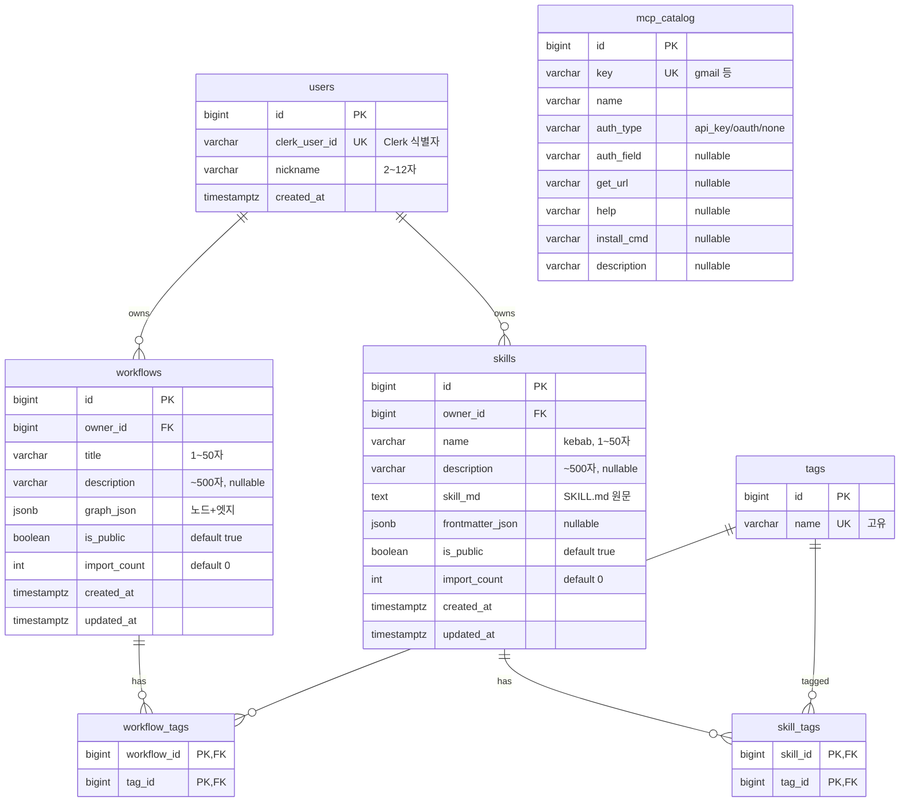

# 🗄️ SkillCanvas — ERD (서버 DB / PostgreSQL)

> API 명세서 기준. **갤러리 서버 DB만** 대상 (로컬 SQLite는 ERD 아님).
> 엔티티 7개: `users` · `workflows` · `skills` · `tags` · `workflow_tags` · `skill_tags` · `mcp_catalog`

---

## 1. ERD 다이어그램 (Mermaid)



> `mcp_catalog`는 **독립 테이블** (다른 것과 관계 없음 — 참조 레지스트리).

---

## 2. 엔티티 상세

### users (앱 유저 · Clerk 연동)
| 컬럼 | 타입 | 제약 | 설명 |
| --- | --- | --- | --- |
| `id` | BIGINT | PK, auto | 유저 id |
| `clerk_user_id` | VARCHAR(255) | **UNIQUE**, NOT NULL | Clerk 식별자 |
| `nickname` | VARCHAR(12) | NOT NULL | 닉네임 (2~12자) |
| `created_at` | TIMESTAMPTZ | NOT NULL, DEFAULT now() | 가입일 |

### workflows
| 컬럼 | 타입 | 제약 | 설명 |
| --- | --- | --- | --- |
| `id` | BIGINT | PK, auto | |
| `owner_id` | BIGINT | **FK → users.id**, NOT NULL | 소유자 |
| `title` | VARCHAR(50) | NOT NULL | 제목 |
| `description` | VARCHAR(500) | NULL | 설명 |
| `graph_json` | JSONB | NOT NULL | 노드+엣지 그래프 |
| `is_public` | BOOLEAN | NOT NULL, DEFAULT true | 공개 여부 |
| `import_count` | INTEGER | NOT NULL, DEFAULT 0 | 가져가기 수 |
| `created_at` | TIMESTAMPTZ | DEFAULT now() | 발행일 |
| `updated_at` | TIMESTAMPTZ | DEFAULT now() | 수정일 |

### skills
| 컬럼 | 타입 | 제약 | 설명 |
| --- | --- | --- | --- |
| `id` | BIGINT | PK, auto | |
| `owner_id` | BIGINT | **FK → users.id**, NOT NULL | 소유자 |
| `name` | VARCHAR(50) | NOT NULL | 스킬명(kebab) |
| `description` | VARCHAR(500) | NULL | 설명 |
| `skill_md` | TEXT | NOT NULL | SKILL.md 원문 |
| `frontmatter_json` | JSONB | NULL | 파싱된 frontmatter |
| `is_public` | BOOLEAN | DEFAULT true | 공개 여부 |
| `import_count` | INTEGER | DEFAULT 0 | 가져가기 수 |
| `created_at` | TIMESTAMPTZ | DEFAULT now() | |
| `updated_at` | TIMESTAMPTZ | DEFAULT now() | |

### tags
| 컬럼 | 타입 | 제약 | 설명 |
| --- | --- | --- | --- |
| `id` | BIGINT | PK, auto | |
| `name` | VARCHAR(30) | **UNIQUE**, NOT NULL | 태그명 |

### workflow_tags (M:N 연결 테이블)
| 컬럼 | 타입 | 제약 | 설명 |
| --- | --- | --- | --- |
| `workflow_id` | BIGINT | **PK, FK → workflows.id**, ON DELETE CASCADE | |
| `tag_id` | BIGINT | **PK, FK → tags.id**, ON DELETE CASCADE | |

> 복합 PK = (workflow_id, tag_id)

### skill_tags (M:N 연결 테이블)
| 컬럼 | 타입 | 제약 | 설명 |
| --- | --- | --- | --- |
| `skill_id` | BIGINT | **PK, FK → skills.id**, ON DELETE CASCADE | |
| `tag_id` | BIGINT | **PK, FK → tags.id**, ON DELETE CASCADE | |

### mcp_catalog (지원 도구 레지스트리 · 독립)
| 컬럼 | 타입 | 제약 | 설명 |
| --- | --- | --- | --- |
| `id` | BIGINT | PK, auto | |
| `key` | VARCHAR(50) | **UNIQUE**, NOT NULL | 식별키 (gmail 등) |
| `name` | VARCHAR(30) | NOT NULL | 표시명 |
| `auth_type` | VARCHAR(20) | NOT NULL | api_key / oauth / none |
| `auth_field` | VARCHAR(50) | NULL | 키 필드명 |
| `get_url` | VARCHAR(500) | NULL | 발급 링크 |
| `help` | VARCHAR(255) | NULL | 발급 안내 문구 |
| `install_cmd` | VARCHAR(255) | NULL | 설치 명령 |
| `description` | VARCHAR(255) | NULL | 설명 |

---

## 3. 관계 요약

| 관계 | 카디널리티 | 구현 |
| --- | --- | --- |
| users — workflows | 1 : N | `workflows.owner_id` FK |
| users — skills | 1 : N | `skills.owner_id` FK |
| workflows — tags | N : M | `workflow_tags` 연결 테이블 |
| skills — tags | N : M | `skill_tags` 연결 테이블 |
| mcp_catalog | 독립 | 관계 없음 |

---

## 4. DBML (dbdiagram.io 붙여넣기용)

```dbml
Table users {
  id bigint [pk, increment]
  clerk_user_id varchar [unique, not null]
  nickname varchar [not null]
  created_at timestamptz [default: `now()`]
}
Table workflows {
  id bigint [pk, increment]
  owner_id bigint [ref: > users.id, not null]
  title varchar [not null]
  description varchar
  graph_json jsonb [not null]
  is_public boolean [default: true]
  import_count int [default: 0]
  created_at timestamptz [default: `now()`]
  updated_at timestamptz [default: `now()`]
}
Table skills {
  id bigint [pk, increment]
  owner_id bigint [ref: > users.id, not null]
  name varchar [not null]
  description varchar
  skill_md text [not null]
  frontmatter_json jsonb
  is_public boolean [default: true]
  import_count int [default: 0]
  created_at timestamptz [default: `now()`]
  updated_at timestamptz [default: `now()`]
}
Table tags {
  id bigint [pk, increment]
  name varchar [unique, not null]
}
Table workflow_tags {
  workflow_id bigint [ref: > workflows.id]
  tag_id bigint [ref: > tags.id]
  indexes { (workflow_id, tag_id) [pk] }
}
Table skill_tags {
  skill_id bigint [ref: > skills.id]
  tag_id bigint [ref: > tags.id]
  indexes { (skill_id, tag_id) [pk] }
}
Table mcp_catalog {
  id bigint [pk, increment]
  key varchar [unique, not null]
  name varchar [not null]
  auth_type varchar [not null]
  auth_field varchar
  get_url varchar
  help varchar
  install_cmd varchar
  description varchar
}
```

---

## 5. 🔎 팀원 피드백 체크리스트 (흔히 틀리는 곳)

> 팀원이 그려온 ERD를 이걸로 검수하면 됨.

| # | 자주 하는 실수 | 정답 |
|---|---------------|------|
| 1 | **M:N을 연결 테이블 없이** workflows에 tags를 컬럼/배열로 | `workflow_tags`·`skill_tags` **연결 테이블** 필요 |
| 2 | 연결 테이블에 **복합 PK 안 잡음** (id 따로 만듦) | `(workflow_id, tag_id)` 복합 PK |
| 3 | **가져가기 수를 별도 테이블**(좋아요처럼)로 | `import_count` **컬럼**이 맞음 (테이블 X) |
| 4 | **FK 방향 반대** (users에 workflow_id 넣음) | FK는 **workflows.owner_id → users.id** (N쪽이 FK 보유) |
| 5 | `clerk_user_id` **UNIQUE 빠뜨림** | UNIQUE 필수 (유저 1:1) |
| 6 | `tags.name` **UNIQUE 빠뜨림** | 같은 태그 중복 방지 → UNIQUE |
| 7 | **mcp_catalog에 FK 연결** (workflows랑 이었다든지) | 독립 테이블 (관계 없음) |
| 8 | `graph_json`/`frontmatter_json`을 **별도 테이블로 쪼갬**(과정규화) | JSONB로 **통째 저장** (그래프는 통으로 다룸) |
| 9 | **워크플로우와 스킬을 한 테이블**로 합침 | 분리 (`graph_json` vs `skill_md`로 성격 다름) |
| 10 | `created_at`/timestamp **누락** | 발행일 등 시각 컬럼 |
| 11 | 삭제 시 **연결 테이블 처리 안 함** | `workflow_tags` **ON DELETE CASCADE** |
| 12 | tags를 workflow/skill **각각 따로** 만듦 | tags는 **공용 1개**, 연결만 2개(workflow_tags·skill_tags) |

---

## 6. 테이블 정의서 (표준 형식 · 테이블별)

> `PK`=기본키 · `FK`=외래키 · `NN`=Not Null · `UQ`=Unique

### users
| 컬럼명 | 데이터 타입 | PK | FK | NN | UQ | 기본값 | 설명 |
| --- | --- | :---: | :---: | :---: | :---: | --- | --- |
| id | BIGINT | ✓ | | ✓ | | auto | 유저 id |
| clerk_user_id | VARCHAR(255) | | | ✓ | ✓ | | Clerk 식별자 |
| nickname | VARCHAR(12) | | | ✓ | | | 닉네임 (2~12자) |
| created_at | TIMESTAMPTZ | | | ✓ | | now() | 가입일 |

### workflows
| 컬럼명 | 데이터 타입 | PK | FK | NN | UQ | 기본값 | 설명 |
| --- | --- | :---: | :---: | :---: | :---: | --- | --- |
| id | BIGINT | ✓ | | ✓ | | auto | 워크플로우 id |
| owner_id | BIGINT | | → users.id | ✓ | | | 소유자 |
| title | VARCHAR(50) | | | ✓ | | | 제목 |
| description | VARCHAR(500) | | | | | NULL | 설명 |
| graph_json | JSONB | | | ✓ | | | 노드+엣지 그래프 |
| is_public | BOOLEAN | | | ✓ | | true | 공개 여부 |
| import_count | INTEGER | | | ✓ | | 0 | 가져가기 수 |
| created_at | TIMESTAMPTZ | | | ✓ | | now() | 발행일 |
| updated_at | TIMESTAMPTZ | | | ✓ | | now() | 수정일 |

### skills
| 컬럼명 | 데이터 타입 | PK | FK | NN | UQ | 기본값 | 설명 |
| --- | --- | :---: | :---: | :---: | :---: | --- | --- |
| id | BIGINT | ✓ | | ✓ | | auto | 스킬 id |
| owner_id | BIGINT | | → users.id | ✓ | | | 소유자 |
| name | VARCHAR(50) | | | ✓ | | | 스킬명(kebab) |
| description | VARCHAR(500) | | | | | NULL | 설명 |
| skill_md | TEXT | | | ✓ | | | SKILL.md 원문 |
| frontmatter_json | JSONB | | | | | NULL | 파싱된 frontmatter |
| is_public | BOOLEAN | | | ✓ | | true | 공개 여부 |
| import_count | INTEGER | | | ✓ | | 0 | 가져가기 수 |
| created_at | TIMESTAMPTZ | | | ✓ | | now() | 발행일 |
| updated_at | TIMESTAMPTZ | | | ✓ | | now() | 수정일 |

### tags
| 컬럼명 | 데이터 타입 | PK | FK | NN | UQ | 기본값 | 설명 |
| --- | --- | :---: | :---: | :---: | :---: | --- | --- |
| id | BIGINT | ✓ | | ✓ | | auto | 태그 id |
| name | VARCHAR(30) | | | ✓ | ✓ | | 태그명 |

### workflow_tags  *(M:N 연결)*
| 컬럼명 | 데이터 타입 | PK | FK | NN | UQ | 기본값 | 설명 |
| --- | --- | :---: | :---: | :---: | :---: | --- | --- |
| workflow_id | BIGINT | ✓ | → workflows.id | ✓ | | | 워크플로우 (ON DELETE CASCADE) |
| tag_id | BIGINT | ✓ | → tags.id | ✓ | | | 태그 (ON DELETE CASCADE) |

> 복합 PK = (workflow_id, tag_id)

### skill_tags  *(M:N 연결)*
| 컬럼명 | 데이터 타입 | PK | FK | NN | UQ | 기본값 | 설명 |
| --- | --- | :---: | :---: | :---: | :---: | --- | --- |
| skill_id | BIGINT | ✓ | → skills.id | ✓ | | | 스킬 (ON DELETE CASCADE) |
| tag_id | BIGINT | ✓ | → tags.id | ✓ | | | 태그 (ON DELETE CASCADE) |

> 복합 PK = (skill_id, tag_id)

### mcp_catalog  *(독립 · 레지스트리)*
| 컬럼명 | 데이터 타입 | PK | FK | NN | UQ | 기본값 | 설명 |
| --- | --- | :---: | :---: | :---: | :---: | --- | --- |
| id | BIGINT | ✓ | | ✓ | | auto | 카탈로그 id |
| key | VARCHAR(50) | | | ✓ | ✓ | | 식별키 (gmail 등) |
| name | VARCHAR(30) | | | ✓ | | | 표시명 |
| auth_type | VARCHAR(20) | | | ✓ | | | api_key / oauth / none |
| auth_field | VARCHAR(50) | | | | | NULL | 키 필드명 |
| get_url | VARCHAR(500) | | | | | NULL | 발급 링크 |
| help | VARCHAR(255) | | | | | NULL | 발급 안내 문구 |
| install_cmd | VARCHAR(255) | | | | | NULL | 설치 명령 |
| description | VARCHAR(255) | | | | | NULL | 설명 |

---

*로컬 SQLite(`processed`·`run_state`·`credentials`)는 ERD 대상 아님 — 단순 상태 저장.*
